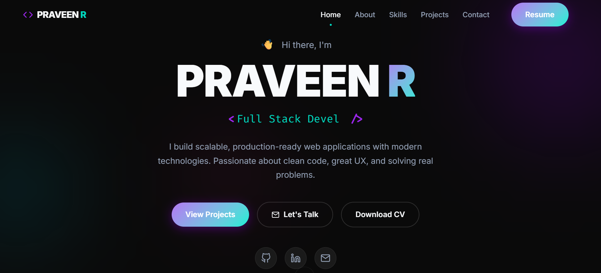
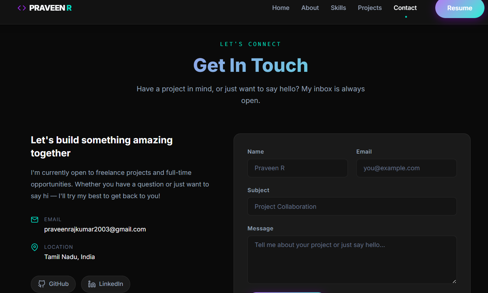

# 🚀 MERN Portfolio Website

A modern Full Stack Portfolio Website built using the MERN Stack. This portfolio showcases my skills, projects, certifications, resume, and provides a contact form integrated with MongoDB Atlas.

---

## 🌐 Live Demo

🔗 **https://mern-portfolio-website-xi.vercel.app**

---

## 💻 GitHub Repository

🔗 **https://github.com/PRAVEEN092003/mern-portfolio-website**

---

## 📖 About the Project

This is a responsive full-stack portfolio website developed using the MERN Stack. The application allows visitors to explore my projects, download my resume, and contact me through a contact form. All submitted messages are securely stored in MongoDB Atlas.

---

## ✨ Features

- Responsive Modern UI
- Hero Section
- About Me
- Skills Section
- Dynamic Projects Section
- Featured Projects
- Contact Form
- Resume Download
- MongoDB Atlas Integration
- REST API
- Mobile Friendly
- Fast Loading
- Live Deployment

---

## 🛠 Tech Stack

### Frontend

- React.js
- Vite
- CSS3
- Axios

### Backend

- Node.js
- Express.js

### Database

- MongoDB Atlas
- Mongoose

### Deployment

- Vercel
- Render

### Version Control

- Git
- GitHub

---

## 📸 Project Screenshots

### 🏠 Home Page



---

### 💼 Projects Section


---

### 📩 Contact Section



---

## 📂 Project Structure

```
mern-portfolio-website
│
├── client
│   ├── public
│   │   └── images
│   ├── src
│   └── package.json
│
├── server
│   ├── config
│   ├── controllers
│   ├── middleware
│   ├── models
│   ├── routes
│   └── package.json
│
└── README.md
```

---

## ⚙ Installation

### Clone Repository

```bash
git clone https://github.com/PRAVEEN092003/mern-portfolio-website.git
```

### Install Frontend

```bash
cd client
npm install
npm run dev
```

### Install Backend

```bash
cd server
npm install
npm run dev
```

---

## 🔐 Environment Variables

Create a `.env` file inside the `server` folder.

```
MONGO_URI=your_mongodb_connection_string
ADMIN_API_KEY=your_admin_api_key
NODE_ENV=development
FRONTEND_URL=http://localhost:5173
```

Create a `.env` file inside the `client` folder.

```
VITE_API_URL=http://localhost:5000/api
```

---

## 📌 Future Improvements

- Authentication (JWT)
- Admin Dashboard
- Blog Section
- Dark / Light Theme Toggle
- Project Categories
- Experience Timeline
- Certificate Showcase

---

## 👨‍💻 Author

### PRAVEEN R

📧 Email

praveenrajkumar2003@gmail.com

GitHub

https://github.com/PRAVEEN092003

---

## ⭐ Support

If you found this project helpful, please consider giving it a ⭐ on GitHub.

---

## 📜 License

This project is created for educational and portfolio purposes.
